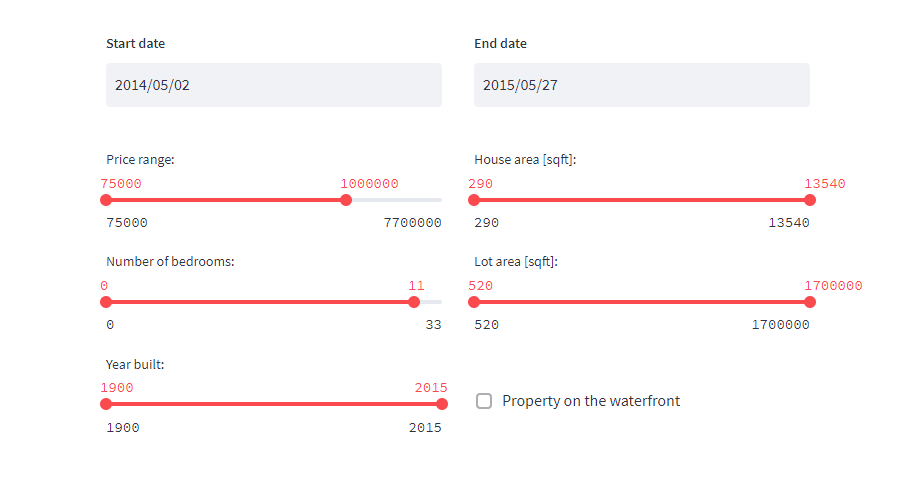
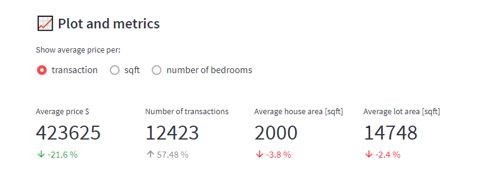
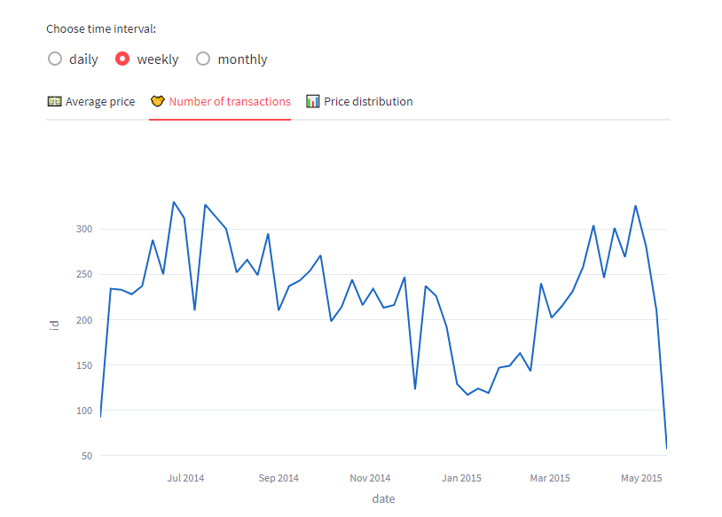
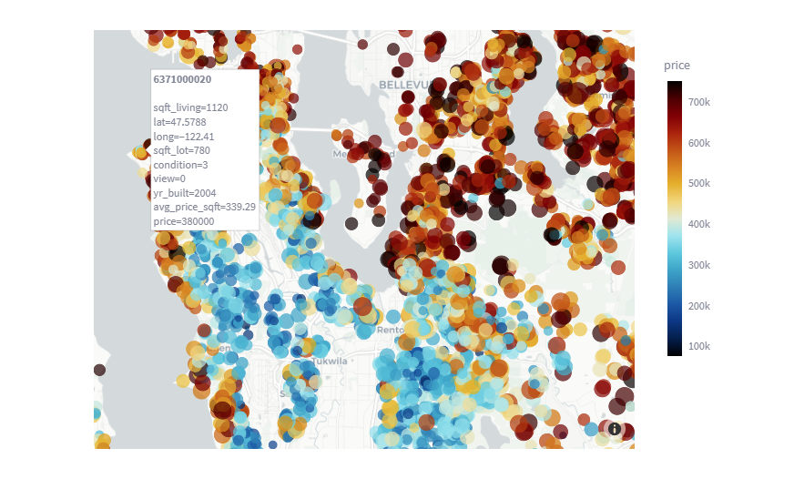

# Introduction

The "House sales in King County" web application is used to analyze historical data on home sales in King County, Washington, USA in 2014-15. The application works online on the website at:

[kc-housesales.streamlit.app](hhttps://kc-housesales.streamlit.app/)

<br>

<br>

The user can view the data using many different filters, such as:
- time range
- price range
- size of the property
- lot size
- number of bedrooms
- year of construction
- access to the waterfront

<br>

<br>

Then, based on the selected criteria, the following information is displayed:
- average price per transaction, sqft and bedrooms
- number of transactions in the selected period (the percentage share in relation to all transactions is displayed in gray below)
- the average area ofthe house
- average lot area
Below are small indicators that indicate the percentage change in relation to the average value for the entire period (except for the number of transactions).

<br>

<br>

Below, charts are automatically generated showing average prices and the number of transactions filtered by the time interval (daily, weekly, monthly). There is also a tab with a histogram showing the distribution of house prices defined by user-defined criteria.

<br>

<br>


In addition, houses that meet the given criteria are displayed on an interactive map. The color indicates the price and the size of the marker refers to the area of the house. When hovering over a specific marker, a label with more data appears. At the very end there is a table with raw data.

<br>

# How it works?

The application was written entirely in Python, mainly using the [Streamlit](https://streamlit.io/) framework and deployed on their server. Data on house sales are stored in the PostgreSQL database temporarily created for the project.

**Website Performance**  
The main application file `app.py` connects to the database every time it is started, retrieves data and stores it in the cache (function/decorator @st.cache_data). Therefore, there is no need to connect to the database every time you change parameters or interact with the website.

**Sync**  
In addition, the application on the Streamlit server is linked to this repository on GitHub and any change/update of the code here causes an automatic change also on the server and, as a result, on the application's website.

**Load date**  
In the `/src` folder there is a `data_loader.py` file containing all the functions related to downloading data from the PostgreSQL database.

**Security**  
In the `.streamlit` folder, there is a `secrets.toml` file that stores the credentials to connect to the database. Thanks to the use of the Streamlit *st.secrets function*, this data is not exposed in any way.

<br>

# Usage

The application can be viewed without any restrictions on the website:

[kc-housesales.streamlit.app](https://kc-housesales.streamlit.app/)
<br><br>

### App installation

The app should work with any Python 3.8+ version. To run it locally on your computer, just clone this repository:

```
git clone https://github.com/wojciechkarcz/King-County-house-sales.git
```

Then you need to install all the dependencies from the `requirements.txt`. Before installation, it is worth creating a separate virtual environment dedicated to this application:

```
pip install -r requirements.txt
```

**Note:** While working on this application, I encountered problems with the installation of the `psycopg2` library used to connect to the PostgreSQL database. Then it's worth trying with Python 3.9.5+ or manually installing the `libpq-dev` package (or run app using Docker).

If you manage to install all the dependencies without any problems, just run the application (being in the main application directory) by typing the command in terminal:

```
streamlit run app.py
```

Streamlit will then create a local server and the application will run at `localhost:8501` in any browser.
<br><br>

### Docker

In this repository there is also a Dockerfile that allows you to build an image with the application locally.

Being in the main application directory, type in the terminal:

```
docker build -t khouse .
```

Then after building the image (this may take a while) run the container:

```
docker run -p 8501:8501 kchouse
```

The Streamlit server in the container will start. To see the application, enter the address: `localhost:8501` in the browser.

